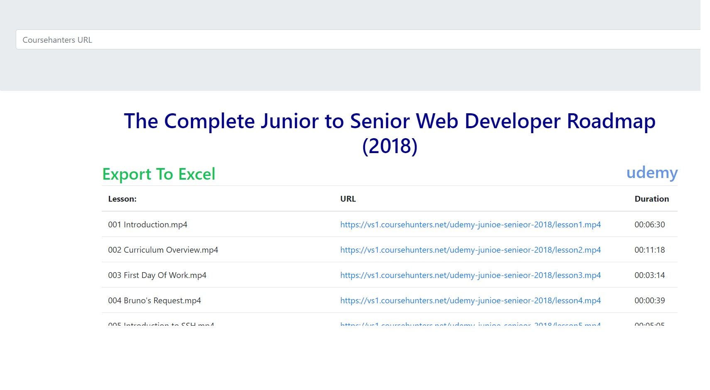

# coursehuntersParser

Этот парсер сделан для сайта: **[Coursehanter](https://coursehunters.net)** в котором собрано много курсов для программирования
Парсер вытаскивает наименования уроков, ссылки на видео и продолжительность уроков для удобного закачивания и последующего переименования файлов.
Все линки удобно закачивать программой ** [4k video downloader](https://www.4kdownload.com/ru/products/product-videodownloader)**
Для групового переименование удобно использовать ** [Total Commander](https://www.ghisler.com/)**, в котором есть возможность загрузить лиси для переименования. [Более детально по переименованию](http://www.tiflocomp.ru/docs/tips_batch_renaming.php).

1. Вводим линк на курс и нажимаем GO
2. Жмем Export To Excel
3. Копируем с Excel ссылки на видео и вставляем в программу 4k video downloader
4. После закачки запускаем скрипт rename.py. Он попросит указать папку, в которой сохранены видео уроки. Скрипт переименует файлы по порядку, в зависимости от к-ва уроков
5. Чтобы переименовать файлы с названием уроков, из Excel файла сохраняем их в .txt
6. Открываем total commander, выделяем .mp4 файлы и выбираем групповое переименование (Ctrl + M in Windows OS). Там есть возможность загрузить наименования с .txt
